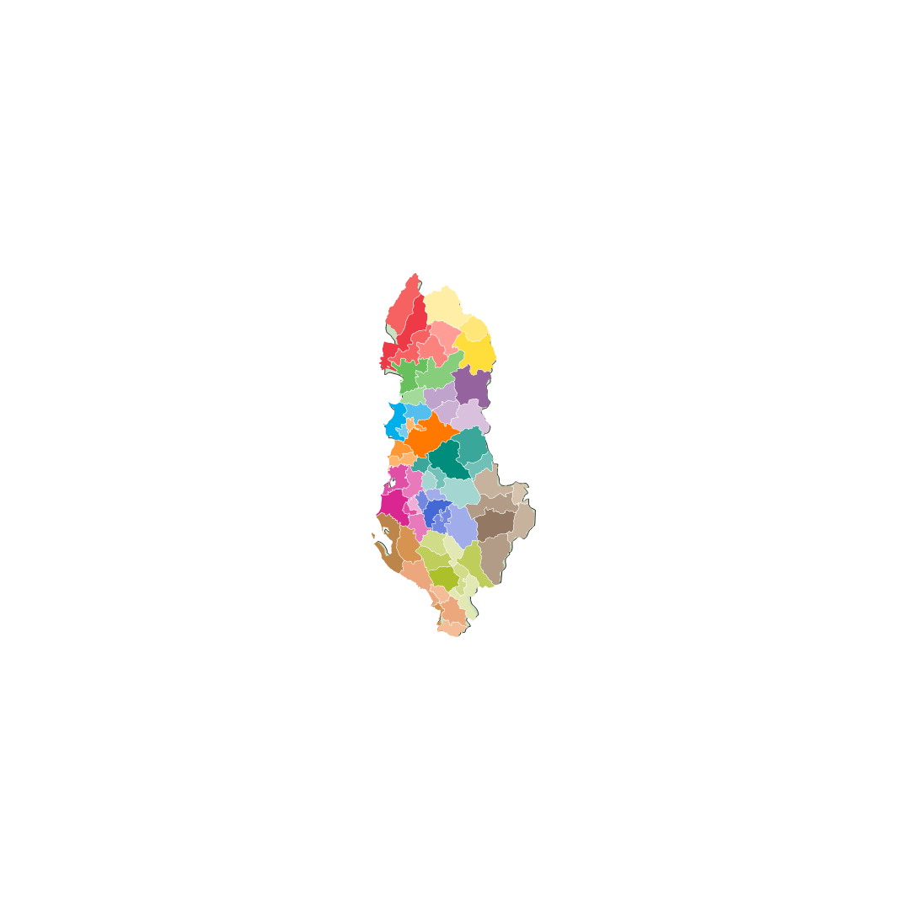
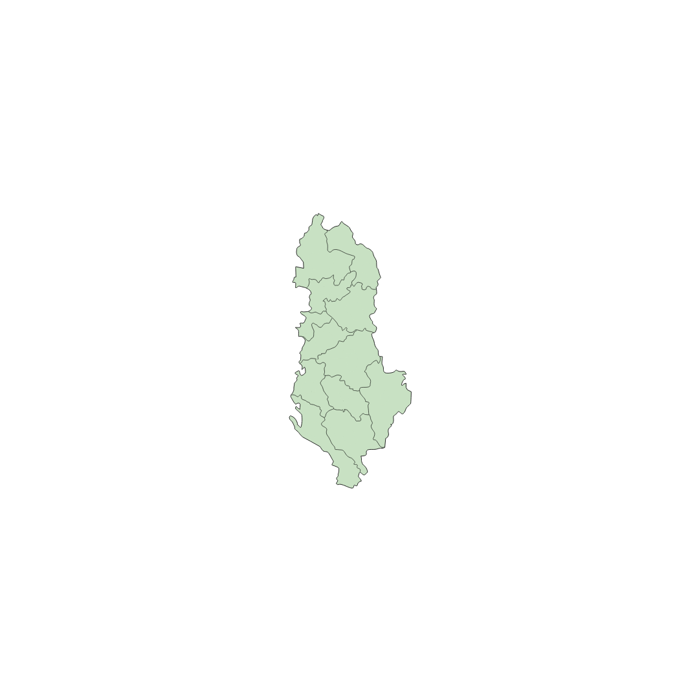

# albania-map

Do të gjeni (svg & png) e bashkive dhe qareve të Shqipërisë me ndarjen e re që u bë më 2016 e cila e zvogëloi numrin e **bashkive në 61.**

---------

You will find the layout (svg & png) of city halls of Albania map from the administrative division made in Albania in 2016, which shrinked the number of **city halls into 61**.

## Bashkite

## Qarqet

## Questions
If you have any questions please use the Issues tab or submit a pull request.

## Contributors
[@ilirhushi](http://ilirhushi.me) & [@edyrkaj](http://www.e-soft.al/Main.aspx)

## React JS / View Map
[Preview](https://github.com/edyrkaj/albania-map/blob/e59bdfa82c180a0eda8684b00a129821a0116b71/albanian_map_svg.mov)
<video src="https://github.com/edyrkaj/albania-map/blob/e59bdfa82c180a0eda8684b00a129821a0116b71/albanian_map_svg.mov" controls width="600">
  Your browser does not support the video tag.
</video>

